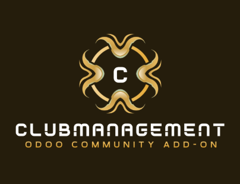

# Club Management for Odoo

A flexible Odoo module for club and association management with granular role assignment and dynamic permissions.

**THIS ADDON IS CURRENTLY UNDER DEVELOPMENT - DO NOT USE YET**

| Author      | Michael Blickenstorfer |
| :---        | ---:                   |
| Version     | 18.0.1.0.0 alpha       |
| Created     | 2025-11-24             |
| Last Update | 2025-11-25             |

## Features

- **Member Management**: Comprehensive member records with complete membership history.
- **Analytical Fields**: Age, year of birth, and days/years in the club, correctly calculated even with multiple memberships or break periods.
- **OCA Integration**: Fields for birthdate, gender, and nationality directly integrated using [partner_contact_birthdate](https://github.com/OCA/partner-contact), [partner_contact_gender](https://github.com/OCA/partner-contact), and [partner_contact_nationality](https://github.com/OCA/partner-contact).
- **Flexible Organization Structure**: Support for Boards, Departments, Pools, and Teams.
- **Advanced Role Model**: Create and assign leadership, assistant, administrative, and special roles per organizational unit.
- **Granular Backend/Web Permissions**: Access control down to exact units and roles; clubs may define custom permission schemes to match their structure.
- **Maximum Flexibility**: Each club can define its own organizational structure, roles, and permissions in the backend.

## Architecture

### Club Member

The `club.member` model represents a club member and includes:
- Link to Odoo contact (`res.partner`)
- Membership roles (`role_ids`)
- Pointers to organizational units (`department_id`, `pool_id`, `team_id`, etc.)

**Analytical Fields:**
- Year of birth and age (calculated from birthdate)
- Club affiliation in days/years (summed across all periods of active membership)

### Role Model (`club.role`)

**Generic & Extensible**:
- Each function or role is defined with the `club.role` model, including a type (`Leader`, `Assistant`, `Admin`, etc.) and its scope (`Board`, `Department`, `Pool`, `Team`)
- Roles are assigned to members via a `Many2many` relation (`role_ids`)
- Organizations are free to configure any role structure in the backend, without code changes

## Permissions & Access Control

The Club Management module defines three user groups that control access rights and permissions within the module:

---

### Group Overview

| Group                               | Label            | Access Scope                | Permissions                                                                                  | Intended Users                                                     |
|--------------------------------------|------------------|-----------------------------|----------------------------------------------------------------------------------------------|--------------------------------------------------------------------|
| `group_clubmanagement_user`          | Standard User    | Club Management module      | View module menus, views, and records.<br>**No administrative actions.**                     | Members who should only view data                                  |
| `group_clubmanagement_master_user`   | Master User      | Departments, Pools, Teams   | Full management (create, edit, delete) of Departments, Pools, and Teams.<br>**No access to Club or Subclub configuration.** | Users responsible for maintaining organizational entities (apartments, teams) |
| `group_clubmanagement_administrator` | Administrator    | Entire module               | Complete administrative access (create, edit, delete) to **all** configurations, including Clubs and Subclubs | Module managers and system administrators                         |

---

### Details by Group

#### 1. Standard User (`group_clubmanagement_user`)

- Can **view** all menus, lists, and records in the Club Management module.
- **Cannot** create, edit, or delete Departments, Pools, Teams, Clubs, or Subclubs.
- Best suited for users who only require read-only access.

#### 2. Master User (`group_clubmanagement_master_user`)

- Can **fully manage** (create, edit, delete) the following:
  - **Departments**
  - **Pools**
  - **Teams**
- **Cannot** manage Clubs or Subclubs.
- Intended for power users responsible for maintaining departments and team structures.

#### 3. Administrator (`group_clubmanagement_administrator`)

- Has **full administrative access** to all module configurations:
  - **Clubs**
  - **Subclubs**
  - **Departments**
  - **Pools**
  - **Teams**
  - *Any other configuration objects added in the future*
- Can create, edit, and delete all records.
- Intended for module managers and system administrators.

### Important Notes about Backend Access

- Assign a user **only the relevant Club Management group** to restrict the menu and feature visibility to the Club Management module.
- The main menu and all submenus/actions are protected by these groups.
  - **Standard User:** Can only view data and menus.
  - **Master User:** Can additionally manage Departments, Pools, and Teams.
  - **Administrator:** Has full access, including Club and Subclub management.
- Group assignment is managed directly in the Odoo user settings.

> **Tip:**  
> Use these groups to ensure clear separation of responsibilities and access control within your system.

---

**Only Administrators** have permission to manage the top-level Clubs and Subclubs.  
Assign group rights via the user form in Odoo as needed.


### Sample dynamic domain
```python
domain = [
    ('role_ids.scope_type', '=', 'department'),
    ('role_ids.department_id', '=', current_department_id),
    ('role_ids.role_type', '=', 'lead')
]
```

## OCA Integration
This module leverages:
- [partner_contact_birthdate](https://github.com/OCA/partner-contact)
- [partner_contact_gender](https://github.com/OCA/partner-contact)
- [partner_contact_nationality](https://github.com/OCA/partner-contact)

## Installation
* Clone full repository to some download area
* Copy addons to custom addons folder (see addon_path in odoo.conf)
* Clone all required OCA addons
* Restart Odoo Server
* Install either via Odoo frontend or with `odoo-bin -d <database> -c <odoo.conf> -i clubmanagement`
* Start customizing